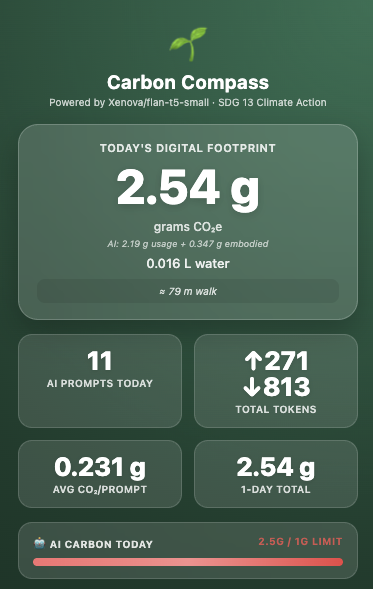
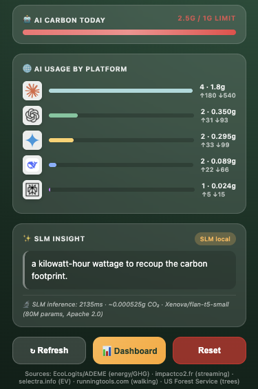
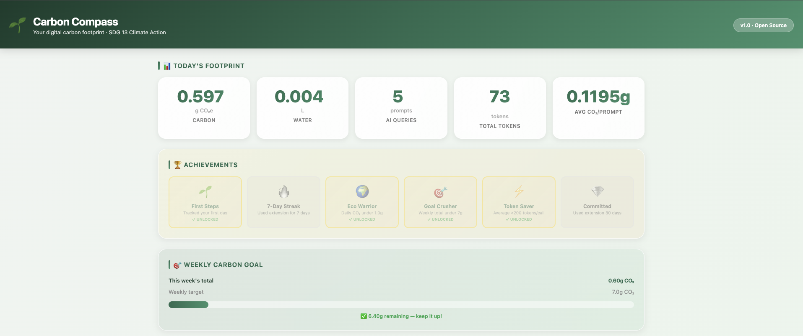
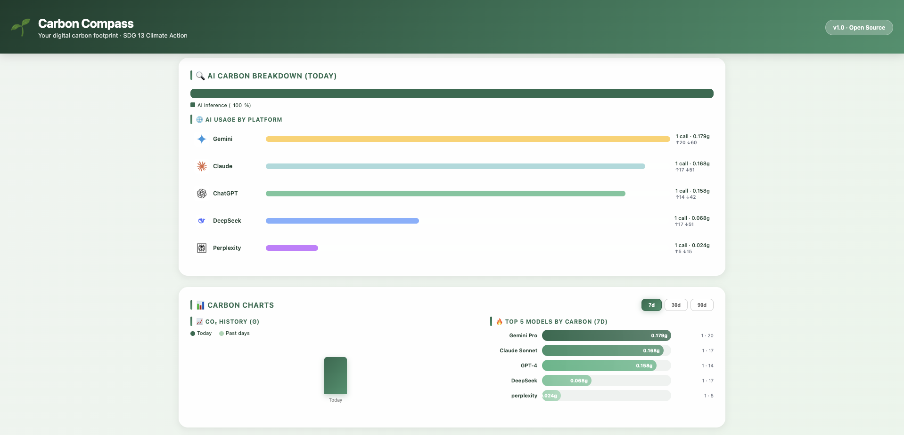

<p align="center">
  
</p>

<h1 align="center">Carbon Compass 🌱</h1>

<p align="center">
  <strong>Track, understand, and reduce your AI carbon footprint</strong>
</p>

<p align="center">
  <a href="#features">Features</a> •
  <a href="#installation">Installation</a> •
  <a href="#how-it-works">How It Works</a> •
  <a href="#privacy">Privacy</a> •
  <a href="#methodology">Methodology</a>
</p>

<p align="center">
  
  
  
  
</p>

---

## What is Carbon Compass?

Carbon Compass is a Chrome extension that makes your AI usage's environmental impact **visible and actionable**. Every time you send a prompt to ChatGPT, Claude, or Gemini, we calculate the CO₂ and water footprint using peer-reviewed methodology — then give you personalized tips to reduce it.

> *"You can't manage what you can't measure."*

---

## Demo

<p align="center">
  <a href="https://www.youtube.com/watch?v=jCyG9MIj5J4">
    
  </a>
</p>

<p align="center"><em>Click to watch the demo video</em></p>

---

## Screenshots

<p align="center">
  
  
</p>

<p align="center">
  
</p>

<p align="center">
  
</p>

---

## Features

### 🔍 Real-Time Tracking
- **AI Usage** — Detects prompts on 7+ platforms with real token counts
- **Carbon & Water** — Calculates CO₂ (grams) and water (mL) per request
- **Model-Aware** — Different costs for GPT-4 vs GPT-4o-mini vs Claude Haiku

### 📊 Dashboard Analytics
- **7-Day History** — CSS bar charts showing daily trends
- **Model Breakdown** — See which AI models cost the most
- **Achievements** — Gamified goals (Eco Warrior, Goal Crusher)
- **CSV Export** — Download your data for analysis

### 🤖 In-Browser SLM
- **flan-t5-small** — 80M parameter model runs 100% locally
- **Personalized Tips** — Context-aware sustainability advice
- **Self-Benchmarking** — We report our own SLM's carbon cost (~0.0005g/tip)

### 💡 Carbon Nudges
- **Instant Feedback** — See CO₂ after every prompt
- **Analogies** — "That's like driving 3 meters" makes it tangible
- **Model Suggestions** — Recommends smaller models when appropriate

---

## Supported Platforms

| Platform | Token Detection | Model Detection |
|----------|-----------------|-----------------|
| ChatGPT | ✅ SSE streaming | ✅ model_slug |
| Claude | ✅ SSE streaming | ✅ event model |
| Gemini | ✅ usageMetadata | ✅ modelVersion |
| DeepSeek | ✅ OpenAI-compatible | ✅ model field |
| Perplexity | ✅ Best-effort | ⚠️ Estimated |
| Copilot | ✅ Best-effort | ⚠️ Estimated |
| Poe | ✅ Best-effort | ⚠️ Estimated |

---

## Installation

### Option 1: Load Unpacked (Developer Mode)

```bash
# 1. Clone the repository
git clone https://github.com/richhuwae/carbon-compass-extension.git
cd carbon-compass-extension

# 2. Download Transformers.js (one-time)
bash setup.sh

# 3. Load in Chrome
# - Open chrome://extensions/
# - Enable "Developer mode" (top right)
# - Click "Load unpacked"
# - Select the carbon-compass-extension folder
```

### Option 2: Chrome Web Store
*Coming soon*

---

## How It Works

### 1. Detection
When you send a prompt, our content script intercepts the API response (via fetch wrapper) and extracts:
- **Token counts** — prompt_tokens + completion_tokens from SSE streams
- **Model name** — GPT-4o, Claude Sonnet, etc.
- **Platform** — ChatGPT, Claude, Gemini, etc.

### 2. Quantification
We apply the **EcoLogits LCA methodology**:

```
Energy = GPU_energy + Server_energy
CO₂ = Energy × PUE × Carbon_Intensity (590.4 gCO₂/kWh)
Water = Energy × (WUE_onsite + PUE × WUE_offsite)
```

This includes both **usage-phase** (electricity) and **embodied** (hardware manufacturing) emissions.

### 3. Feedback
- **Nudge** — Appears after each prompt with CO₂ + analogy
- **Popup** — Shows daily totals, limit progress, platform breakdown
- **Dashboard** — 7-day trends, achievements, model rankings
- **SLM Tips** — Personalized advice from our in-browser AI

---

## Privacy

### 🔒 Zero Data Collection

| We Track | We DON'T Track |
|----------|----------------|
| ✅ Token counts (numbers) | ❌ Prompt content |
| ✅ Model names | ❌ Conversation text |
| ✅ Timestamps | ❌ Personal information |
| ✅ Platform (ChatGPT/Claude) | ❌ Account details |

### 🏠 100% Local Processing

```
┌─────────────────────────────────────┐
│         YOUR BROWSER                │
│  ┌───────────┐    ┌──────────────┐  │
│  │ Carbon    │ →  │ Chrome Local │  │
│  │ Compass   │    │ Storage      │  │
│  └───────────┘    └──────────────┘  │
│         ↓                           │
│  ┌───────────────────────────────┐  │
│  │  SLM runs via WebAssembly    │  │
│  │  No external API calls       │  │
│  └───────────────────────────────┘  │
└─────────────────────────────────────┘
        ❌ No servers · ❌ No uploads · ❌ No tracking
```

---

## Methodology

Our quantification is based on **EcoLogits** — the only open-source methodology that accounts for both usage-phase AND embodied emissions.

### Key Constants

| Parameter | Value | Source |
|-----------|-------|--------|
| Carbon Intensity | 590.4 gCO₂eq/kWh | ADEME World Mix |
| GPU Embodied | 273 kgCO₂eq | NVIDIA H100 LCA |
| Server Embodied | 5,700 kgCO₂eq | BoaviztAPI |
| Hardware Lifetime | 3 years | Industry standard |

### Per-Request Benchmarks (150 output tokens)

| Model | CO₂ | Analogy |
|-------|-----|---------|
| GPT-4o | 0.12g | 📱 Charging phone 12 sec |
| Claude Opus | 0.08g | 💡 LED bulb for 48 sec |
| Claude Sonnet | 0.03g | 📧 Sending 3 emails |
| GPT-4o-mini | 0.02g | 🚶 Walking 15cm |
| Gemini Flash | 0.01g | 🔋 0.5 sec laptop standby |

📄 **Full methodology:** [BENCHMARK.md](BENCHMARK.md)

---

## Tech Stack

| Component | Technology |
|-----------|------------|
| Extension | Chrome Manifest V3 |
| SLM | Xenova/flan-t5-small via Transformers.js |
| Runtime | WebAssembly (ONNX) |
| Storage | chrome.storage.local |
| Charts | Pure CSS (no libraries) |

---

## Project Structure

```
carbon-compass-extension/
├── manifest.json          # MV3 config, permissions, CSP
├── background.js          # Service worker: carbon math, storage, alarms
├── content.js             # Injected: AI detection, SSE parsing, nudges
├── popup.html/js          # Extension popup UI
├── dashboard.html/js      # Full-page analytics dashboard
├── slm-worker.js          # Web Worker: flan-t5-small inference
├── transformers.min.js    # Transformers.js IIFE bundle
├── ort-wasm-*.wasm        # ONNX Runtime WebAssembly
├── logos/                 # Platform logos (ChatGPT, Claude, etc.)
├── BENCHMARK.md           # Full methodology + academic sources
├── PROJECT_CARBON_COST.md # Meta: this project's own carbon footprint
└── setup.sh               # Downloads transformers.min.js
```

---

## Development Carbon Cost

We practice what we preach. Building Carbon Compass with GitHub Copilot CLI (Claude Opus 4.5) cost:

| Metric | Value |
|--------|-------|
| Total CO₂ | ~60 gCO₂eq |
| Total Water | ~0.48 L |
| Sessions | 29 |
| Break-even | 100 users × 1 week |

📄 **Full analysis:** [PROJECT_CARBON_COST.md](PROJECT_CARBON_COST.md)

---

## Contributing

We welcome contributions! Here's how:

1. **Fork** the repository
2. **Create** a feature branch (`git checkout -b feature/amazing-feature`)
3. **Commit** your changes (`git commit -m 'Add amazing feature'`)
4. **Push** to the branch (`git push origin feature/amazing-feature`)
5. **Open** a Pull Request

### Ideas for Contributions
- [ ] Firefox port (Manifest V3)
- [ ] More AI platforms (Midjourney, DALL-E)
- [ ] Localization (i18n)
- [ ] Dark mode
- [ ] Team/enterprise features

---

## Academic Citation

If you use Carbon Compass in research:

```bibtex
@software{carbon_compass_2026,
  title = {Carbon Compass: AI Carbon Footprint Tracker},
  author = {Edwin Richard Huwae},
  year = {2026},
  url = {https://github.com/richhuwae/carbon-compass-extension},
  note = {Chrome extension using EcoLogits LCA methodology}
}
```

---

## Acknowledgments

- **[EcoLogits](https://ecologits.ai/)** — LCA methodology and calculator
- **[Transformers.js](https://huggingface.co/docs/transformers.js)** — In-browser ML inference
- **[ADEME](https://www.ademe.fr/)** — Carbon intensity data (Base Empreinte®)
- **[CodeCarbon](https://codecarbon.io/)** — Inspiration for tracking approach

---

## License

Apache 2.0 — See [LICENSE](LICENSE) for details.

---

<p align="center">
  <strong>🌍 SDG 13 · Climate Action</strong><br>
  <em>"Tools reflect values. We use AI to reduce AI's impact."</em>
</p>

<p align="center">
  <a href="https://sdgs.un.org/goals/goal13">
    
  </a>
</p>
